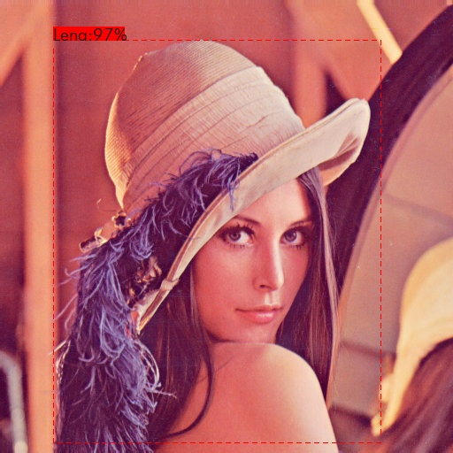

plotbox
========

Xujing

Go, Plot Bounding Box!

Demo
---------

::

    image = cv2.imread("./test.jpg")
    pt1=(60,45)
    pt2=(430,500)
    # plot box
    drawRect(image,pt1,pt2,(0,0,255),thickness=1,style='dotted_1')
    
    # text_en
    myText = 'Lena:97%'
    font_size = 20
    t_size = cv2.getTextSize(myText, 0, fontScale=0.2, thickness=2)[0]
 
    new_pt2 = (pt1[0]+15*len(myText), pt1[1] - t_size[1]+10)
    new_pt2 = (pt1[0] + len(myText)*10), pt1[1] - t_size[1] - 10
    
    cv2.rectangle(image, pt1, new_pt2, (0,0,255), -1)  # filled
    image = drawText(image,myText, (pt1[0],pt1[1] - t_size[1] - 20),font_size,(0,0,0))

    cv2.imshow('image',image)
    cv2.waitKey()   

::

   

    image = cv2.imread("./test.jpg")
    pt1=(60,45)
    pt2=(430,500)
    # plot box
    drawRect(image,pt1,pt2,(0,0,255),thickness=1,style='solid')

    # text_cn
    myText = '莱娜:97%'
    font_size = 20

    t_size = cv2.getTextSize(myText, 0, fontScale=0.2, thickness=2)[0]
 
    new_pt2 = (pt1[0]+15*len(myText), pt1[1] - t_size[1]+10)
    new_pt2 = (pt1[0] + len(myText)*15), pt1[1] - t_size[1] - 20
    
    cv2.rectangle(image, pt1, new_pt2, (0,0,255), -1)  # filled
    image = drawText(image,myText, (pt1[0],pt1[1] - t_size[1] - 15),font_size,(0,0,0),font='cn_3')

    cv2.imshow('image',image)
    cv2.waitKey()    

the result like this:

HomePage
----------

* homepage: https://github.com/DataXujing/plotbox2

